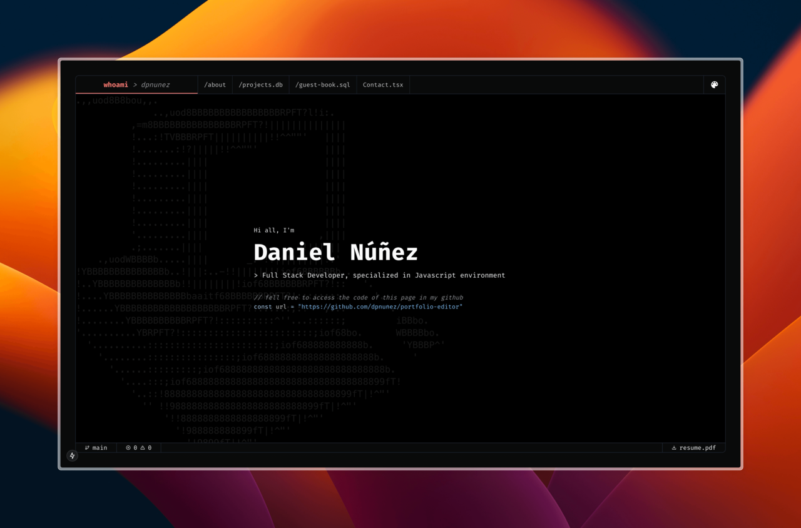

# 🎨 **Portfolio** - Code Editor Simulation ✨

Welcome to **Portfolio 2025**, a modern, interactive landing page that simulates a sophisticated code editor. This project is designed to showcase my front-end development skills and deliver an engaging, immersive experience. Whether you're exploring my projects or interacting with the editor, you'll see how I use modern technologies to create seamless and functional web experiences.

🚀 **Live Demo**: [View Portfolio](https://portfolio-editor-gamma.vercel.app/)

## 🛠️ **Tech Stack**

This project is powered by an array of cutting-edge technologies that provide a sleek and responsive experience:

### Front-end:

- **React** - A flexible and efficient JavaScript library for building dynamic user interfaces.
- **Next.js** - Full-stack framework for React, enabling fast server-side rendering, static site generation, and API routes.
- **Tailwind CSS** - Utility-first CSS framework for styling and responsive layouts.
- **Radix UI (ShadCN)** - Headless UI components for building accessible, customizable design systems.
- **React Syntax Highlighter** - Highlighting code snippets in the simulated editor for enhanced readability.
- **Lucide React** - Beautiful, customizable icons for a modern UI.
- **React Icons** - Access to popular icon libraries for a consistent design language.
- **React Hook Form** - Performant form validation and management for user interactions.
- **Motion** - Smooth animations for dynamic interactions.
- **Prisma** - Powerful ORM for managing data and schema.

### Back-end:

- **Prisma** - Next-generation ORM for interacting with databases in Node.js apps.
- **NextAuth** - Authentication library for handling user sessions and login flows.
- **Supabase** - Real-time database and authentication for seamless user management.

### Development Tools:

- **Vite** - Fast, optimized development environment for quicker builds.
- **Vitest** - Lightning-fast unit testing for React components.
- **Playwright** - End-to-end testing framework for simulating real-world user interactions.
- **ESLint & Prettier** - Code linting and formatting for clean, consistent code.
- **Commitizen** - Standardized commit messages for a clean Git history.
- **Semantic Release** - Automated versioning and release notes based on commit history.

### Deployment:

- **Vercel** - Serverless deployment platform optimized for Next.js apps.
- **GitHub Actions** - CI/CD workflows for automating testing and deployment processes.

<br />

## ✨ **Features**

### **💻 Interactive Code Editor Simulation**

- Simulate a real-world development environment with syntax highlighting.
- Supports multiple programming languages (JavaScript, HTML, CSS, and more).
- Customizable themes (Dark/Light modes) for a personalized experience.

### **🔐 Authentication and Session Management**

- Sign in with ease using **NextAuth** to simulate user login and manage sessions.

### **🔧 Fully Customizable UI with Radix UI**

- Leveraging Radix UI components for accessibility and a seamless user experience. Customizable dialogs, dropdowns, and accordions.

### **⚡ Fast & Reliable Testing**

- Unit tests with **Vitest** and end-to-end tests powered by **Playwright** to ensure smooth functionality.

<br />

## 🚧 **Future Improvements / Debts**

While the current version of **Portfolio** offers a solid foundation and interactive experience, there are still several areas for improvement and features to be added in future updates:

### 🔄 **Code Editor Enhancements**

- **New themes**: Add more themes and customization options for the code editor, currently whe only have GitHub Dark and Light.
- **Initial Loader Animation on Guest Book**: Add a loader animation to the guest book while fetching the comments (this page use SSR to fetch messages, so it can take a time before showing the page result).

### 🧪 **Testing Enhancements**

- **Add testing integrate with NextAuth**: Add tests for the authentication flow and session management

<br />

## 💡 **Installation**

### 1. **Clone the Repository**

```bash
git clone https://github.com/dpnunez/portfolio-editor.git
```

### 2. **Install Dependencies**

> **Important**: Make sure you have **Node.js** installed on your machine, the version is specified in nvmrc.

```bash
cd portfolio-editor
npm install
```

### 3. **Run the Development Server**

```bash
npm run dev
```

Your local server should be running at [http://localhost:3000](http://localhost:3000).

### 4. **Prisma Setup (Optional for Database Integration)**

If you’re planning to use the back-end features:

1. Generate the Prisma client:

   ```bash
   npm run postinstall
   ```

2. Set up the database schema and run migrations as needed.

<br />

## 🌐 **Live Demo**

Explore the live version of the portfolio here:  
[**Portfolio Live Demo**](https://portfolio-editor-gamma.vercel.app/)

<br />

## 🧪 **Testing**

### Unit Tests

Run the unit tests with **Vitest**:

```bash
npm run test:unit
```

### End-to-End Tests

Run end-to-end tests with **Playwright**:

```bash
npx playwright test
```

<br />

## 📜 **License**

This project is licensed under the **MIT License**.
